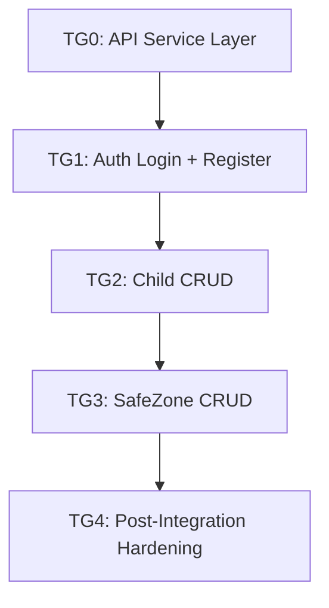

# Malaz Flutter — API Integration Audit & Roadmap

> **Date:** 2026-03-13  
> **Scope:** Flutter-side API integration ONLY  
> **Sources of truth:** [Malaz.postman_collection.json](file:///c:/Users/Alios/OneDrive/Desktop/My%20Grad..%20project/Malaz-Flutter/Malaz.postman_collection.json) (contracts) + real Flutter repository (implementation)  
> **Base URL:** `https://malaz.runasp.net`

---

## A. Scope Lock

### ✅ Inside my responsibility
- Mapping Postman-grounded backend contracts to Flutter code
- Determining which APIs are implemented, partially implemented, or missing
- Identifying model/serialization mismatches against actual API responses
- Creating an integration-only roadmap ordered by dependency and risk
- Writing reusable rules for future bounded coding prompts

### ❌ Outside my responsibility
- UI redesign, UX suggestions, product ideas, feature invention
- Broad refactoring, architecture redesign
- Backend changes, database assumptions
- Implementing features without grounded Postman contracts
- Any code implementation in this report

---

## B. Grounded API Inventory

All endpoints extracted from [Malaz.postman_collection.json](file:///c:/Users/Alios/OneDrive/Desktop/My%20Grad..%20project/Malaz-Flutter/Malaz.postman_collection.json). Base URL: `malaz.runasp.net`

### B1. Auth Domain

| # | Name | Method | Path | Auth | Request Summary | Response Summary |
|---|------|--------|------|------|-----------------|------------------|
| 1 | Login | `POST` | `/Auth/login` | ❌ No | `{email, password}` | `{success, user{id,name,email}, token, roles[], errorMessages}` |
| 2 | Register | `POST` | `/Auth/register` | ❌ No | `{userName, email, password, confirmPassword}` | `{id, name, email, success, errorMessages[]}` |

> [!IMPORTANT]
> - Login response returns a **JWT token** and a **roles array** (e.g. `["Parent"]`).
> - Register request uses `userName` (not `name`), and does **not** include `phone`.
> - Register response does **not** return a `token` — a separate Login call is needed after registration.

### B2. Child (Parent) Domain

| # | Name | Method | Path | Auth | Request Summary | Response Summary |
|---|------|--------|------|------|-----------------|------------------|
| 3 | AddChild | `POST` | `/Child/addchild` | ✅ Bearer | `{name, birthDate, gender(int), deviceId}` | `{success, errorMessages[], data{id, name, gender(int), birthDate, deviceId, safeZones[]}}` |
| 4 | GetMyChildren | `GET` | `/Child/mychildren` | ✅ Bearer | — | `{success, errorMessages[], data[{id, name, gender(int), birthDate, deviceId, safeZones[]}]}` |
| 5 | GetChild | `GET` | `/Child/{childId}` | ✅ Bearer | — | `{success, errorMessages[], data{id, name, gender(int), birthDate, deviceId, safeZones[…]}}` |

> [!IMPORTANT]
> - `gender` is an **integer** (0 = male, 1 = female), not a string.
> - `birthDate` format is `"YYYY-MM-DD"` in request, returned as `"YYYY-MM-DDTHH:MM:SS"`.
> - The API uses **camelCase** keys (e.g. `birthDate`, `deviceId`), not snake_case.

### B3. SafeZone Domain

| # | Name | Method | Path | Auth | Request Summary | Response Summary |
|---|------|--------|------|------|-----------------|------------------|
| 6 | Add | `POST` | `/api/SafeZone/add` | ✅ Bearer | `{childId, name, latitude, longitude, radiusInMeters, type(int)}` | `{success, errorMessages[], data{id, name, latitude, longitude, radiusInMeters, type(int), typeDisplayName, createdAt}}` |
| 7 | GetAllForChild | `GET` | `/api/SafeZone/child/{childId}` | ✅ Bearer | — | `{success, errorMessages[], data[{id, name, latitude, longitude, radiusInMeters, type, typeDisplayName, createdAt}]}` |
| 8 | GetOneZone | `GET` | `/api/SafeZone/{zoneId}` | ✅ Bearer | — | `{success, errorMessages[], data{id, name, latitude, longitude, radiusInMeters, type, typeDisplayName, createdAt}}` |
| 9 | Update | `PUT` | `/api/SafeZone/{zoneId}` | ✅ Bearer | `{Name, Latitude, Longitude, RadiusInMeters}` | `{success, errorMessages[], data{…updated zone…}}` |
| 10 | Delete | `DELETE` | `/api/SafeZone/{zoneId}` | ✅ Bearer | — | `{success, errorMessages[], data: null}` |

> [!IMPORTANT]
> - SafeZone paths are under `/api/SafeZone/…` (note the `/api/` prefix), unlike Auth and Child which have no prefix.
> - `type` is an integer (0 = School, 1 = Home).

---

## C. Current Flutter API Integration Status

> [!CAUTION]
> **Zero real HTTP calls exist in the entire Flutter codebase.** The `http` package is listed in [pubspec.yaml](file:///c:/Users/Alios/OneDrive/Desktop/My%20Grad..%20project/Malaz-Flutter/pubspec.yaml) but is never imported or used in any file. Every single provider uses `Future.delayed()` with hardcoded dummy data.

### C1. Auth — Login

| Field | Detail |
|-------|--------|
| **Status** | 🔴 **NOT IMPLEMENTED** (100% mocked) |
| **Evidence** | [auth_provider.dart](file:///c:/Users/Alios/OneDrive/Desktop/My%20Grad..%20project/Malaz-Flutter/lib/providers/auth_provider.dart#L142-L175) — `Future.delayed(Duration(seconds: 2))`, fake token `fake_token_…`, hardcoded name `محمد أحمد` |
| **Files** | [providers/auth_provider.dart](file:///c:/Users/Alios/OneDrive/Desktop/My%20Grad..%20project/Malaz-Flutter/lib/providers/auth_provider.dart), [models/user_model.dart](file:///c:/Users/Alios/OneDrive/Desktop/My%20Grad..%20project/Malaz-Flutter/lib/models/user_model.dart), [screens/login_screen.dart](file:///c:/Users/Alios/OneDrive/Desktop/My%20Grad..%20project/Malaz-Flutter/lib/screens/login_screen.dart) |
| **Safe to build on?** | ❌ No — needs full replacement with real HTTP POST |

**Key mismatches vs. Postman contract:**
- API returns `roles[]` — Flutter [UserModel](file:///c:/Users/Alios/OneDrive/Desktop/My%20Grad..%20project/Malaz-Flutter/lib/models/user_model.dart#1-52) has no `roles` field
- API does not return `phone` — Flutter model has `phone` field
- API response wraps user in `user` key with `token` at top level — no parsing logic exists

### C2. Auth — Register

| Field | Detail |
|-------|--------|
| **Status** | 🔴 **NOT IMPLEMENTED** (100% mocked) |
| **Evidence** | [auth_provider.dart](file:///c:/Users/Alios/OneDrive/Desktop/My%20Grad..%20project/Malaz-Flutter/lib/providers/auth_provider.dart#L46-L117) — `Future.delayed(Duration(seconds: 2))`, generates fake `userId` and `token` locally |
| **Files** | [providers/auth_provider.dart](file:///c:/Users/Alios/OneDrive/Desktop/My%20Grad..%20project/Malaz-Flutter/lib/providers/auth_provider.dart), [models/user_model.dart](file:///c:/Users/Alios/OneDrive/Desktop/My%20Grad..%20project/Malaz-Flutter/lib/models/user_model.dart), [screens/register_screen.dart](file:///c:/Users/Alios/OneDrive/Desktop/My%20Grad..%20project/Malaz-Flutter/lib/screens/register_screen.dart) |
| **Safe to build on?** | ❌ No |

**Key mismatches vs. Postman contract:**
- Flutter register accepts `phone` — API contract does **NOT** have a `phone` field
- API expects `userName` — Flutter sends `name`
- API register response does **NOT** return a `token` — Flutter fakes one
- After real register, app must do a separate Login call to get a token

### C3. Child — AddChild

| Field | Detail |
|-------|--------|
| **Status** | 🔴 **NOT IMPLEMENTED** (100% mocked) |
| **Evidence** | [child_provider.dart](file:///c:/Users/Alios/OneDrive/Desktop/My%20Grad..%20project/Malaz-Flutter/lib/providers/child_provider.dart#L15-L47) — `Future.delayed(Duration(seconds: 2))`, generates fake [id](file:///c:/Users/Alios/OneDrive/Desktop/My%20Grad..%20project/Malaz-Flutter/lib/providers/auth_provider.dart#5-228) locally, stores only in memory |
| **Files** | [providers/child_provider.dart](file:///c:/Users/Alios/OneDrive/Desktop/My%20Grad..%20project/Malaz-Flutter/lib/providers/child_provider.dart), [models/child_mode.dart](file:///c:/Users/Alios/OneDrive/Desktop/My%20Grad..%20project/Malaz-Flutter/lib/models/child_mode.dart), [screens/add_child_screen.dart](file:///c:/Users/Alios/OneDrive/Desktop/My%20Grad..%20project/Malaz-Flutter/lib/screens/add_child_screen.dart) |
| **Safe to build on?** | ❌ No |

**Key mismatches vs. Postman contract:**
- API expects `gender` as **int** (0/1) — Flutter passes a **string** (`ذكر`/`أنثى`)
- API does not expect `userId` in request body (derived from JWT) — Flutter model includes `userId`
- `ChildModel.fromJson()` uses **snake_case** keys (`birth_date`, `device_id`) — API returns **camelCase** (`birthDate`, `deviceId`)

### C4. Child — GetMyChildren

| Field | Detail |
|-------|--------|
| **Status** | 🔴 **NOT IMPLEMENTED** |
| **Evidence** | No method exists in [child_provider.dart](file:///c:/Users/Alios/OneDrive/Desktop/My%20Grad..%20project/Malaz-Flutter/lib/providers/child_provider.dart) to fetch children from API. Children list is maintained only in memory (added via local [addChild](file:///c:/Users/Alios/OneDrive/Desktop/My%20Grad..%20project/Malaz-Flutter/lib/providers/child_provider.dart#15-49)) |
| **Files** | [providers/child_provider.dart](file:///c:/Users/Alios/OneDrive/Desktop/My%20Grad..%20project/Malaz-Flutter/lib/providers/child_provider.dart), [screens/home_screen.dart](file:///c:/Users/Alios/OneDrive/Desktop/My%20Grad..%20project/Malaz-Flutter/lib/screens/home_screen.dart) |
| **Safe to build on?** | ❌ No — method does not exist |

### C5. Child — GetChild (by ID)

| Field | Detail |
|-------|--------|
| **Status** | 🔴 **NOT IMPLEMENTED** |
| **Evidence** | [getChildById()](file:///c:/Users/Alios/OneDrive/Desktop/My%20Grad..%20project/Malaz-Flutter/lib/providers/child_provider.dart#62-69) in [child_provider.dart](file:///c:/Users/Alios/OneDrive/Desktop/My%20Grad..%20project/Malaz-Flutter/lib/providers/child_provider.dart) only searches the local in-memory list. No HTTP call exists |
| **Files** | [providers/child_provider.dart](file:///c:/Users/Alios/OneDrive/Desktop/My%20Grad..%20project/Malaz-Flutter/lib/providers/child_provider.dart) |
| **Safe to build on?** | ❌ No |

### C6. SafeZone — Add

| Field | Detail |
|-------|--------|
| **Status** | 🔴 **NOT IMPLEMENTED** |
| **Evidence** | [newsafezone_screen.dart](file:///c:/Users/Alios/OneDrive/Desktop/My%20Grad..%20project/Malaz-Flutter/lib/screens/newsafezone_screen.dart#L45-L67) — [_addSafeZone()](file:///c:/Users/Alios/OneDrive/Desktop/My%20Grad..%20project/Malaz-Flutter/lib/screens/newsafezone_screen.dart#45-69) creates an inline [Map](file:///c:/Users/Alios/OneDrive/Desktop/My%20Grad..%20project/Malaz-Flutter/lib/screens/newsafezone_screen.dart#29-44) and passes it to [SafeZonesScreen](file:///c:/Users/Alios/OneDrive/Desktop/My%20Grad..%20project/Malaz-Flutter/lib/screens/safezone_screen.dart#8-21) via constructor. No HTTP call, no provider method |
| **Files** | [screens/newsafezone_screen.dart](file:///c:/Users/Alios/OneDrive/Desktop/My%20Grad..%20project/Malaz-Flutter/lib/screens/newsafezone_screen.dart), [models/safe_zone_model.dart](file:///c:/Users/Alios/OneDrive/Desktop/My%20Grad..%20project/Malaz-Flutter/lib/models/safe_zone_model.dart) |
| **Safe to build on?** | ❌ No |

**Key mismatches:**
- [SafeZoneModel](file:///c:/Users/Alios/OneDrive/Desktop/My%20Grad..%20project/Malaz-Flutter/lib/models/safe_zone_model.dart#1-16) is missing: `type`, `typeDisplayName`, `radiusInMeters`, `createdAt`, `childId`, `fromJson()`, [toJson()](file:///c:/Users/Alios/OneDrive/Desktop/My%20Grad..%20project/Malaz-Flutter/lib/providers/notification_provider.dart#53-65)
- No SafeZone provider exists at all

### C7. SafeZone — GetAllForChild

| Field | Detail |
|-------|--------|
| **Status** | 🔴 **NOT IMPLEMENTED** |
| **Evidence** | [safezone_screen.dart](file:///c:/Users/Alios/OneDrive/Desktop/My%20Grad..%20project/Malaz-Flutter/lib/screens/safezone_screen.dart#L29-L33) — hardcoded list: `[{'name': 'المدرسه'}, {'name': 'المنزل'}, {'name': 'النادي'}]` |
| **Files** | [screens/safezone_screen.dart](file:///c:/Users/Alios/OneDrive/Desktop/My%20Grad..%20project/Malaz-Flutter/lib/screens/safezone_screen.dart) |
| **Safe to build on?** | ❌ No |

### C8. SafeZone — GetOneZone

| Field | Detail |
|-------|--------|
| **Status** | 🔴 **NOT IMPLEMENTED** |
| **Evidence** | No code references this endpoint anywhere |
| **Files** | — |
| **Safe to build on?** | ❌ No |

### C9. SafeZone — Update

| Field | Detail |
|-------|--------|
| **Status** | 🔴 **NOT IMPLEMENTED** |
| **Evidence** | No code references this endpoint anywhere |
| **Files** | — |
| **Safe to build on?** | ❌ No |

### C10. SafeZone — Delete

| Field | Detail |
|-------|--------|
| **Status** | 🔴 **NOT IMPLEMENTED** |
| **Evidence** | No code references this endpoint anywhere |
| **Files** | — |
| **Safe to build on?** | ❌ No |

### Summary Table

| # | Endpoint | Status | Real HTTP Call? |
|---|----------|--------|-----------------|
| 1 | `POST /Auth/login` | 🔴 NOT IMPLEMENTED | ❌ |
| 2 | `POST /Auth/register` | 🔴 NOT IMPLEMENTED | ❌ |
| 3 | `POST /Child/addchild` | 🔴 NOT IMPLEMENTED | ❌ |
| 4 | `GET /Child/mychildren` | 🔴 NOT IMPLEMENTED | ❌ |
| 5 | `GET /Child/{id}` | 🔴 NOT IMPLEMENTED | ❌ |
| 6 | `POST /api/SafeZone/add` | 🔴 NOT IMPLEMENTED | ❌ |
| 7 | `GET /api/SafeZone/child/{id}` | 🔴 NOT IMPLEMENTED | ❌ |
| 8 | `GET /api/SafeZone/{id}` | 🔴 NOT IMPLEMENTED | ❌ |
| 9 | `PUT /api/SafeZone/{id}` | 🔴 NOT IMPLEMENTED | ❌ |
| 10 | `DELETE /api/SafeZone/{id}` | 🔴 NOT IMPLEMENTED | ❌ |

> **Result: 0 out of 10 endpoints are implemented. The entire app runs on local dummy data.**

---

## D. Excluded or Blocked App Areas

These visible screens/features must **NOT** be part of the API implementation plan because they have no grounded backend contract in the Postman collection.

| Screen / Feature | Why Excluded | Dummy / Local? | Blocked by Missing Contract? | Source Needed |
|------------------|-------------|----------------|------------------------------|---------------|
| **Chatbot** ([chatbot_screen.dart](file:///c:/Users/Alios/OneDrive/Desktop/My%20Grad..%20project/Malaz-Flutter/lib/screens/chatbot_screen.dart), [chatbot_plus_screen.dart](file:///c:/Users/Alios/OneDrive/Desktop/My%20Grad..%20project/Malaz-Flutter/lib/screens/chatbot_plus_screen.dart), [chatbot_provider.dart](file:///c:/Users/Alios/OneDrive/Desktop/My%20Grad..%20project/Malaz-Flutter/lib/providers/chatbot_provider.dart)) | No Postman endpoint for chatbot/AI messaging | ✅ 100% local — [_getBotResponse()](file:///c:/Users/Alios/OneDrive/Desktop/My%20Grad..%20project/Malaz-Flutter/lib/providers/chatbot_provider.dart#162-174) uses hardcoded if/else, [loadDummyChats()](file:///c:/Users/Alios/OneDrive/Desktop/My%20Grad..%20project/Malaz-Flutter/lib/providers/chatbot_provider.dart#36-56), [addDummyMessages()](file:///c:/Users/Alios/OneDrive/Desktop/My%20Grad..%20project/Malaz-Flutter/lib/providers/chatbot_provider.dart#57-97) | ✅ Yes | Need chatbot API contract (e.g. POST `/api/Chat/send`) |
| **Notifications** ([notifications_screen.dart](file:///c:/Users/Alios/OneDrive/Desktop/My%20Grad..%20project/Malaz-Flutter/lib/screens/notifications_screen.dart), [notification_provider.dart](file:///c:/Users/Alios/OneDrive/Desktop/My%20Grad..%20project/Malaz-Flutter/lib/providers/notification_provider.dart), [notification_setting_screen.dart](file:///c:/Users/Alios/OneDrive/Desktop/My%20Grad..%20project/Malaz-Flutter/lib/screens/notification_setting_screen.dart)) | No Postman endpoint for notifications | ✅ 100% local — [loadDummyData()](file:///c:/Users/Alios/OneDrive/Desktop/My%20Grad..%20project/Malaz-Flutter/lib/providers/notification_provider.dart#140-220) with hardcoded Arabic text | ✅ Yes | Need notifications API contract (e.g. GET `/api/Notifications`) |
| **Child Details — health data** ([child_details_screen.dart](file:///c:/Users/Alios/OneDrive/Desktop/My%20Grad..%20project/Malaz-Flutter/lib/screens/child_details_screen.dart) heart rate, activity status, battery, location display) | No Postman endpoint for device telemetry/health data | ✅ 100% hardcoded — `92 نبضه/دقيقه`, `50%` battery, `المدرسه` location | ✅ Yes | Need device telemetry / IoT API contract |
| **Settings** ([setting_screen.dart](file:///c:/Users/Alios/OneDrive/Desktop/My%20Grad..%20project/Malaz-Flutter/lib/screens/setting_screen.dart)) — Edit Profile, Change Password, Delete Account, Security, Privacy, Contact Us | No Postman endpoints for user profile management | ✅ 100% local — all modal forms just show SnackBar "saved" without any API call | ✅ Yes | Need user management API contracts (PUT profile, PATCH password, DELETE account) |
| **Google Sign In** ([login_screen.dart](file:///c:/Users/Alios/OneDrive/Desktop/My%20Grad..%20project/Malaz-Flutter/lib/screens/login_screen.dart), [register_screen.dart](file:///c:/Users/Alios/OneDrive/Desktop/My%20Grad..%20project/Malaz-Flutter/lib/screens/register_screen.dart) — [_handleGoogleSignIn](file:///c:/Users/Alios/OneDrive/Desktop/My%20Grad..%20project/Malaz-Flutter/lib/screens/login_screen.dart#122-138)) | Shows SnackBar "قريباً" (coming soon) | ✅ Placeholder only | ✅ Yes | Need OAuth / social auth contract |
| **Forgot Password** ([login_screen.dart](file:///c:/Users/Alios/OneDrive/Desktop/My%20Grad..%20project/Malaz-Flutter/lib/screens/login_screen.dart)) | Shows SnackBar "قريباً" (coming soon) | ✅ Placeholder only | ✅ Yes | Need password reset API contract |
| **Premium / Upgrade** ([chatbot_plus_screen.dart](file:///c:/Users/Alios/OneDrive/Desktop/My%20Grad..%20project/Malaz-Flutter/lib/screens/chatbot_plus_screen.dart)) | No Postman endpoint for subscriptions | ✅ UI only | ✅ Yes | Need subscription/payment API contract |

> [!WARNING]
> **Do NOT implement any of the above features until their backend contracts are provided and documented in Postman or an equivalent source.** Implementing them now would mean inventing API shapes, which violates the scope lock.

---

## E. Integration-Only Roadmap

### Pre-requisite: API Service Layer (Task Group 0)

| Field | Detail |
|-------|--------|
| **Title** | Create shared API service infrastructure |
| **Scope** | Create a reusable `ApiService` class with base URL, common headers, JWT token injection, and standard error/response parsing based on the common response envelope `{success, errorMessages[], data}` |
| **Why first** | Every endpoint needs this. Without it, each integration task would duplicate boilerplate |
| **Files involved** | NEW: `lib/services/api_service.dart` or `lib/helpers/api_service.dart` |
| **Completion criteria** | Class exists with [get()](file:///c:/Users/Alios/OneDrive/Desktop/My%20Grad..%20project/Malaz-Flutter/lib/providers/child_provider.dart#62-69), `post()`, [put()](file:///c:/Users/Alios/OneDrive/Desktop/My%20Grad..%20project/Malaz-Flutter/lib/screens/chatbot_screen.dart#501-543), [delete()](file:///c:/Users/Alios/OneDrive/Desktop/My%20Grad..%20project/Malaz-Flutter/lib/providers/notification_provider.dart#290-302) methods; reads token from `SharedPrefs.authToken`; parses the standard `{success, errorMessages, data}` envelope; throws typed exceptions on failure |
| **Must NOT touch** | Any screen, any existing provider logic, any UI |

---

### Task Group 1: Auth — Login + Register

| Field | Detail |
|-------|--------|
| **Title** | Integrate Auth Login and Register endpoints |
| **Scope** | (1) Update [UserModel](file:///c:/Users/Alios/OneDrive/Desktop/My%20Grad..%20project/Malaz-Flutter/lib/models/user_model.dart#1-52) to match API response shape (add `roles`, remove `phone` or make optional, handle nested `user` key). (2) Replace mocked [login()](file:///c:/Users/Alios/OneDrive/Desktop/My%20Grad..%20project/Malaz-Flutter/lib/providers/auth_provider.dart#121-177) in [AuthProvider](file:///c:/Users/Alios/OneDrive/Desktop/My%20Grad..%20project/Malaz-Flutter/lib/providers/auth_provider.dart#5-228) with real `POST /Auth/login` using `ApiService`. (3) Replace mocked [register()](file:///c:/Users/Alios/OneDrive/Desktop/My%20Grad..%20project/Malaz-Flutter/lib/providers/auth_provider.dart#46-119) in [AuthProvider](file:///c:/Users/Alios/OneDrive/Desktop/My%20Grad..%20project/Malaz-Flutter/lib/providers/auth_provider.dart#5-228) with real `POST /Auth/register`. (4) After successful register, auto-call [login()](file:///c:/Users/Alios/OneDrive/Desktop/My%20Grad..%20project/Malaz-Flutter/lib/providers/auth_provider.dart#121-177) to get a token. (5) Save real JWT token to [SharedPrefs](file:///c:/Users/Alios/OneDrive/Desktop/My%20Grad..%20project/Malaz-Flutter/lib/helpers/shared_prefs.dart#3-45). |
| **Why this order** | Auth is the dependency for every authenticated endpoint. Nothing else can be tested until Login works |
| **Files involved** | [models/user_model.dart](file:///c:/Users/Alios/OneDrive/Desktop/My%20Grad..%20project/Malaz-Flutter/lib/models/user_model.dart), [providers/auth_provider.dart](file:///c:/Users/Alios/OneDrive/Desktop/My%20Grad..%20project/Malaz-Flutter/lib/providers/auth_provider.dart), [helpers/shared_prefs.dart](file:///c:/Users/Alios/OneDrive/Desktop/My%20Grad..%20project/Malaz-Flutter/lib/helpers/shared_prefs.dart), `services/api_service.dart` |
| **Completion criteria** | Real register creates user on backend; real login returns JWT; token is stored; subsequent API calls can use it; error messages from backend are shown in UI |
| **Must NOT touch** | Screen UI layout, navigation flow, onboarding screens, chatbot, notifications, settings |

> [!IMPORTANT]
> **Contract mismatch to fix:** Register screen collects `phone` but API does not accept it. Two options: (a) keep the field in UI but don't send it, or (b) remove it. This is a decision point — flag for the developer.

---

### Task Group 2: Child — AddChild + GetMyChildren + GetChild

| Field | Detail |
|-------|--------|
| **Title** | Integrate Child management endpoints |
| **Scope** | (1) Fix [ChildModel](file:///c:/Users/Alios/OneDrive/Desktop/My%20Grad..%20project/Malaz-Flutter/lib/models/child_mode.dart#1-53) — change `fromJson`/[toJson](file:///c:/Users/Alios/OneDrive/Desktop/My%20Grad..%20project/Malaz-Flutter/lib/providers/notification_provider.dart#53-65) to use **camelCase** keys matching API, change `gender` from `String` to [int](file:///c:/Users/Alios/OneDrive/Desktop/My%20Grad..%20project/Malaz-Flutter/lib/screens/chatbot_screen.dart#611-630), remove `userId` from model (API derives it from JWT). (2) Add `fetchMyChildren()` method to [ChildProvider](file:///c:/Users/Alios/OneDrive/Desktop/My%20Grad..%20project/Malaz-Flutter/lib/providers/child_provider.dart#4-82) using `GET /Child/mychildren`. (3) Add `fetchChild(id)` method using `GET /Child/{id}`. (4) Replace mocked [addChild()](file:///c:/Users/Alios/OneDrive/Desktop/My%20Grad..%20project/Malaz-Flutter/lib/providers/child_provider.dart#15-49) with real `POST /Child/addchild`. (5) Call `fetchMyChildren()` on [HomeScreen](file:///c:/Users/Alios/OneDrive/Desktop/My%20Grad..%20project/Malaz-Flutter/lib/screens/home_screen.dart#13-19) init so children load from server. |
| **Why this order** | Depends on Task Group 1 (needs auth token). Child data is needed before SafeZone work |
| **Files involved** | [models/child_mode.dart](file:///c:/Users/Alios/OneDrive/Desktop/My%20Grad..%20project/Malaz-Flutter/lib/models/child_mode.dart), [providers/child_provider.dart](file:///c:/Users/Alios/OneDrive/Desktop/My%20Grad..%20project/Malaz-Flutter/lib/providers/child_provider.dart), [screens/home_screen.dart](file:///c:/Users/Alios/OneDrive/Desktop/My%20Grad..%20project/Malaz-Flutter/lib/screens/home_screen.dart), [screens/add_child_screen.dart](file:///c:/Users/Alios/OneDrive/Desktop/My%20Grad..%20project/Malaz-Flutter/lib/screens/add_child_screen.dart) |
| **Completion criteria** | Adding a child persists on backend; home screen loads children list from API on launch; child details load from API; new children appear in the list after add |
| **Must NOT touch** | SafeZone screens, chatbot, notifications, settings, child_details_screen health data (still dummy) |

---

### Task Group 3: SafeZone — Full CRUD

| Field | Detail |
|-------|--------|
| **Title** | Integrate SafeZone CRUD endpoints |
| **Scope** | (1) Rewrite [SafeZoneModel](file:///c:/Users/Alios/OneDrive/Desktop/My%20Grad..%20project/Malaz-Flutter/lib/models/safe_zone_model.dart#1-16) — add all fields: [id](file:///c:/Users/Alios/OneDrive/Desktop/My%20Grad..%20project/Malaz-Flutter/lib/providers/auth_provider.dart#5-228), `name`, `latitude`, `longitude`, `radiusInMeters`, `type`(int), `typeDisplayName`, `createdAt`, `childId`(for request); add `fromJson()`/[toJson()](file:///c:/Users/Alios/OneDrive/Desktop/My%20Grad..%20project/Malaz-Flutter/lib/providers/notification_provider.dart#53-65). (2) Create NEW `SafeZoneProvider` with: `fetchZonesForChild(childId)`, `fetchZone(zoneId)`, `addZone(…)`, `updateZone(zoneId, …)`, `deleteZone(zoneId)`. (3) Register provider in [main.dart](file:///c:/Users/Alios/OneDrive/Desktop/My%20Grad..%20project/Malaz-Flutter/lib/main.dart). (4) Wire [SafeZonesScreen](file:///c:/Users/Alios/OneDrive/Desktop/My%20Grad..%20project/Malaz-Flutter/lib/screens/safezone_screen.dart#8-21) to fetch from API instead of hardcoded list. (5) Wire [NewSafeZoneScreen](file:///c:/Users/Alios/OneDrive/Desktop/My%20Grad..%20project/Malaz-Flutter/lib/screens/newsafezone_screen.dart#8-15) to call `addZone()` with real data (name + lat/lng from map + radius + type). (6) Re-use [GoogleMapScreen](file:///c:/Users/Alios/OneDrive/Desktop/My%20Grad..%20project/Malaz-Flutter/lib/screens/google_map.dart#12-19) lat/lng selection to populate the `latitude`/`longitude` fields. |
| **Why this order** | Depends on Task Groups 1+2 (needs token + child IDs) |
| **Files involved** | [models/safe_zone_model.dart](file:///c:/Users/Alios/OneDrive/Desktop/My%20Grad..%20project/Malaz-Flutter/lib/models/safe_zone_model.dart), NEW: `providers/safezone_provider.dart`, [main.dart](file:///c:/Users/Alios/OneDrive/Desktop/My%20Grad..%20project/Malaz-Flutter/lib/main.dart), [screens/safezone_screen.dart](file:///c:/Users/Alios/OneDrive/Desktop/My%20Grad..%20project/Malaz-Flutter/lib/screens/safezone_screen.dart), [screens/newsafezone_screen.dart](file:///c:/Users/Alios/OneDrive/Desktop/My%20Grad..%20project/Malaz-Flutter/lib/screens/newsafezone_screen.dart), [screens/google_map.dart](file:///c:/Users/Alios/OneDrive/Desktop/My%20Grad..%20project/Malaz-Flutter/lib/screens/google_map.dart) |
| **Completion criteria** | SafeZones list loads from API per child; new zones are created via API; zones can be updated and deleted; map coordinates are sent correctly |
| **Must NOT touch** | Chatbot, notifications, settings, child health data display, authentication flow |

---

### Task Group 4: Post-Integration Hardening

| Field | Detail |
|-------|--------|
| **Title** | Token lifecycle, error handling, and loading states |
| **Scope** | (1) Handle 401 responses globally (token expired → redirect to login). (2) Ensure all API errors surface backend `errorMessages[]` to the user. (3) Verify loading indicators work correctly with real network latency. (4) Handle offline/network error cases gracefully. (5) On app launch (`SplashScreen`), validate stored token is still valid before navigating to home. |
| **Why this order** | Can only be done after all endpoints are wired |
| **Files involved** | `services/api_service.dart`, [providers/auth_provider.dart](file:///c:/Users/Alios/OneDrive/Desktop/My%20Grad..%20project/Malaz-Flutter/lib/providers/auth_provider.dart), `screens/splash_screen.dart` |
| **Completion criteria** | Expired tokens cause logout; network errors show user-friendly messages; no unhandled exceptions |
| **Must NOT touch** | Any feature not grounded in Postman |

---

### Visual Dependency Chain



---

## F. Rules for Future Coding-Agent Prompts

Paste the following into any future AI coding prompt to keep it inside scope:

```
RULES FOR THIS CODING TASK:

1. CONTRACT-GROUNDED: Only implement endpoints that exist in `Malaz.postman_collection.json`.
   Do NOT invent API paths, request shapes, or response shapes.

2. REPO-GROUNDED: Before changing any file, read the current state of that file first.
   Do NOT assume file content — verify it.

3. ONE TASK ONLY: Implement exactly ONE Task Group per prompt.
   Do NOT combine multiple Task Groups. Do NOT "while we're at it" add extra work.

4. NO BROAD REFACTORS: Change only the files listed in the Task Group scope.
   Do NOT reorganize folder structures, rename files outside scope, or add architecture layers not requested.

5. NO GUESSING: If an API response shape is unclear, STOP and ask.
   Do NOT assume fields exist that are not in the Postman collection.

6. NO UI CHANGES beyond wiring: Connect existing UI to real data.
   Do NOT redesign screens, change layouts, add new screens, or modify animations.

7. NO OUT-OF-SCOPE AREAS: Do NOT touch chatbot, notifications, settings, health data, or any
   feature without a grounded Postman contract.

8. MATCH THE CONTRACT EXACTLY:
   - Use camelCase keys as the API returns them (birthDate, deviceId, radiusInMeters)
   - gender is int (0 = male, 1 = female), not a string
   - SafeZone paths start with /api/SafeZone/..., Auth/Child paths do NOT have /api/ prefix

9. TOKEN HANDLING: Store the real JWT from login response in SharedPrefs.
   Attach it as Bearer token to all authenticated requests. Do NOT use fake tokens.

10. ERROR HANDLING: All API calls must handle:
    - Network errors (try/catch)
    - Non-200 status codes
    - The standard {success: false, errorMessages: [...]} envelope
    Surface backend errorMessages to the user.

11. VERIFY: After implementing, confirm:
    - No remaining Future.delayed() fake calls in the changed files
    - No hardcoded dummy data in the changed files
    - fromJson/toJson matches actual API response exactly
    - The http package is actually imported and used

12. BASE URL: https://malaz.runasp.net
    Auth endpoints: /Auth/login, /Auth/register
    Child endpoints: /Child/addchild, /Child/mychildren, /Child/{id}
    SafeZone endpoints: /api/SafeZone/add, /api/SafeZone/child/{id}, /api/SafeZone/{id}
```

---

## G. Final Recommendation

### Do first: **Task Group 0 + Task Group 1 (API Service Layer + Auth)**

Auth is the absolute prerequisite for everything. Without a real login producing a real JWT token, no other endpoint can be tested or integrated. Start here.

### Must wait (in order):
1. **Task Group 2 (Child CRUD)** — after Auth works
2. **Task Group 3 (SafeZone CRUD)** — after Child works
3. **Task Group 4 (Hardening)** — after all CRUD works

### Must NOT be touched until a contract exists:
- ❌ Chatbot / AI messaging
- ❌ Notifications / alerts / reports
- ❌ Device health telemetry (heart rate, battery, activity)
- ❌ User profile management (edit profile, change password, delete account)
- ❌ Google Sign In / social auth
- ❌ Forgot password
- ❌ Premium / subscription features

> [!CAUTION]
> **None of these features have a backend contract.** Implementing them would require inventing API shapes, which will cause rework when real contracts arrive. Wait for grounded contracts before touching them.
